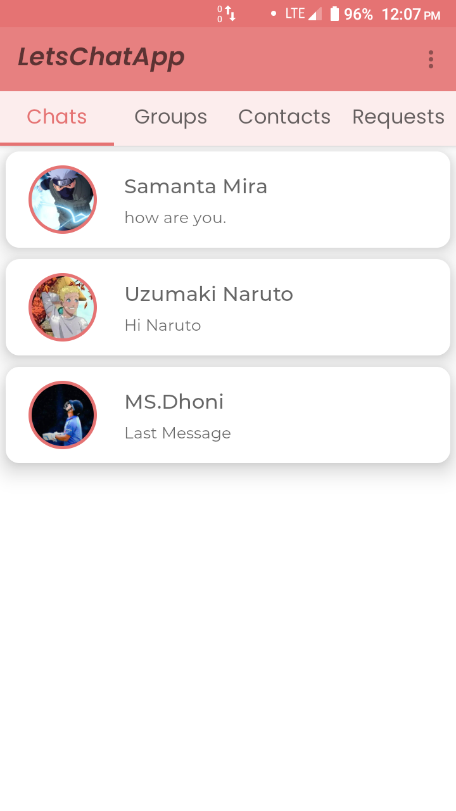

# LetsChatApp-WhatsAppClone
This is an chatting app just like whats app.This app is build using firebase as backend.You can send friend request,add friends,remove friends,chat with them,send them pictures,pdfs
and do lot more stuff using this app.This app is inspired from whats app and has lot of similar features like whatsapp.User can create an account using his email address
or he can use his mobile number for creating an account.Users can create an group and use group chat functionality.

#### Languages:Kotlin,XML

#### Library/Technologies Used:

1.Froentend Kotlin,XML.

2.Backend: Firebase Database.

3.Firebase realtime database,storage,authentication etc.

4.FirebaseUi library for fetching data from firebase and show them in recycler views.

5.Recycler Views,View Pager,Android Material Themes,Constraint Layouts etc.

#### App Screenshots: 

Account Settings Screen:

Accept/Send Friend Requests:

One to one chat Page:

All chats page:

See send/received request screen:

